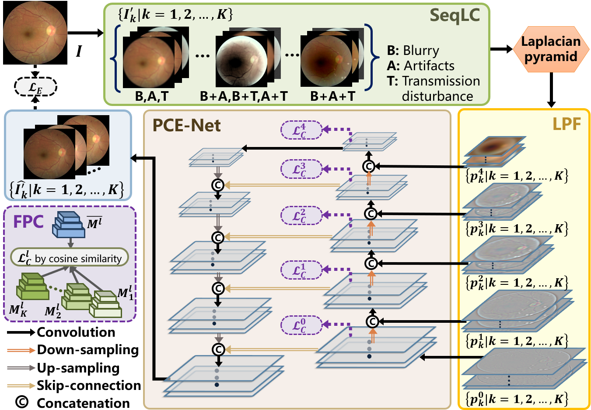

# **Degradation-invariant Enhancement of Fundus Images via Pyramid Constraint Network**
Source code for Degradation-invariant Enhancement of Fundus Images via Pyramid Constraint Network, which will be released soon.

Here, we propose the PCE-Net for the enhancement of low-quality fundus images. 



# Prerequisites

\- Win10

\- Python 3

\- CPU or NVIDIA GPU + CUDA CuDNN

# Environment (Using conda)

```
conda install numpy pyyaml mkl mkl-include setuptools cmake cffi typing opencv-python

conda install pytorch torchvision -c pytorch # add cuda90 if CUDA 9

conda install visdom dominate -c conda-forge # install visdom and dominate

conda install scipy
```

# Obtain the simulated low-quality images

- Put the clear data from an fundus image dataset, e.g. EyeQ, into data/get_low_quality/image/high_quality_image_original.
- cd data/get_low_quality, and run
- python run_pre_process.py % get the preprocess images
- python main_degradation.py %  get the low quality images and their parameters.
- Or you can specify the input and output directory.
- And you can use the same method to 
- After getting your data, you can use the data to arrange your dataset.
  - create datasets/fiq_dataset
  - move datasets/get_low_quality_image/image/high_quality_pre_process/image to: datasets/fiq_dataset/source_gt
  - move datasets/get_low_quality_image/image/high_quality_pre_process/mask to: datasets/fiq_dataset/source_mask
  - move datasets/get_low_quality_image/image/low_quality_image to: datasets/fiq_dataset/source_image
  - if you want to create your own target data for testing, you can create target_gt, target_gt_mask, target_image and target_mask, whose format is the same as source

# Visualization when training

```
python -m visdom.server -p 8099
```

# To open this link in the browser

http://localhost:8099/

# Dataset preparation

To set up your own dataset constructed like images/cataract_dataset. Note that the number of source images should be bigger than the number of target images, or you can design you own data loader.

## Trained model's weight

https://drive.google.com/file/d/1XoFHHuxsfApFBQtrhYtB6DXKTrq0IgBS/view?usp=sharing

or use link: https://pan.baidu.com/s/1RVxauHpmD13wt0fu_NbRgQ, code: 43tf

and place it to ./pretrain_model

# Command to run

Please note that root directory is the project root directory.

## Train

```
python train.py --dataroot ./datasets/fiq_dataset --name train_pcenet --model pcenet --input_nc 3 --direction AtoB --batch_size 4 --DR_batch_size 4 --lr_policy linear --n_epochs 150 --n_epochs_decay 50 --dataset_mode fiq_batch --gpu_ids 0 --eval_test --eval_when_train --test_ssim_psnr --source_clear_num_images 2000
```

if you use the pretrain weight to train a new mode, you can use the followed command:

```
python train.py --dataroot ./datasets/fiq_dataset --name train_pcenet --model pcenet --input_nc 3 --direction AtoB --batch_size 4 --DR_batch_size 4 --lr_policy linear --n_epochs 150 --n_epochs_decay 50 --dataset_mode fiq_batch --gpu_ids 0 --eval_test --eval_when_train --test_ssim_psnr --pretrain_model pcenet_pretrain --source_clear_num_images 2000
```

--source_clear_num_images is the number of clear images in dataset

## Test

```
python test.py --dataroot ./datasets/fiq_dataset --name train_pcenet --model pcenet --netG pce_backbone --input_nc 3 --direction AtoB --dataset_mode fiq_basic --gpu_ids 0 --not_use_prepare_mask --no_reference
```

if you have reference, please don't use --no_reference

if you want to use the pretrain model for test, you can rename the name of the pretrain model to latest_net_G.pth, then
place it to ./checkpoints/pcenet/latest_net_G.pth
```
python test.py --dataroot ./datasets/fiq_dataset --name pcenet --model pcenet --netG pce_backbone --input_nc 3 --direction AtoB --dataset_mode fiq_basic --gpu_ids 0 --not_use_prepare_mask --no_reference
```

# Reference

[1] Liu H, Li H, Fu H, et al. Degradation-Invariant Enhancement of Fundus Images via Pyramid Constraint Network[C]//International Conference on Medical Image Computing and Computer-Assisted Intervention. Springer, Cham, 2022: 507-516.

```
@inproceedings{liu2022degradation,
  title={Degradation-Invariant Enhancement of Fundus Images via Pyramid Constraint Network},
  author={Liu, Haofeng and Li, Heng and Fu, Huazhu and Xiao, Ruoxiu and Gao, Yunshu and Hu, Yan and Liu, Jiang},
  booktitle={International Conference on Medical Image Computing and Computer-Assisted Intervention},
  pages={507--516},
  year={2022},
  organization={Springer}
}
```